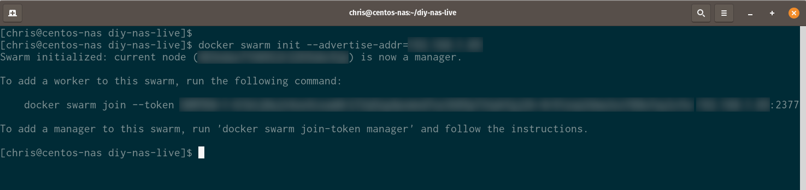
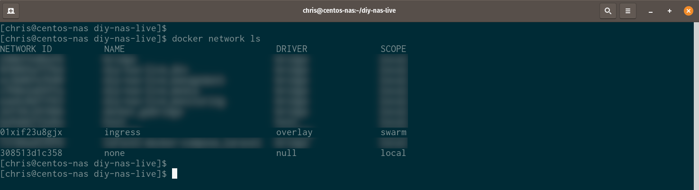
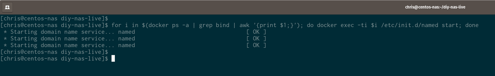
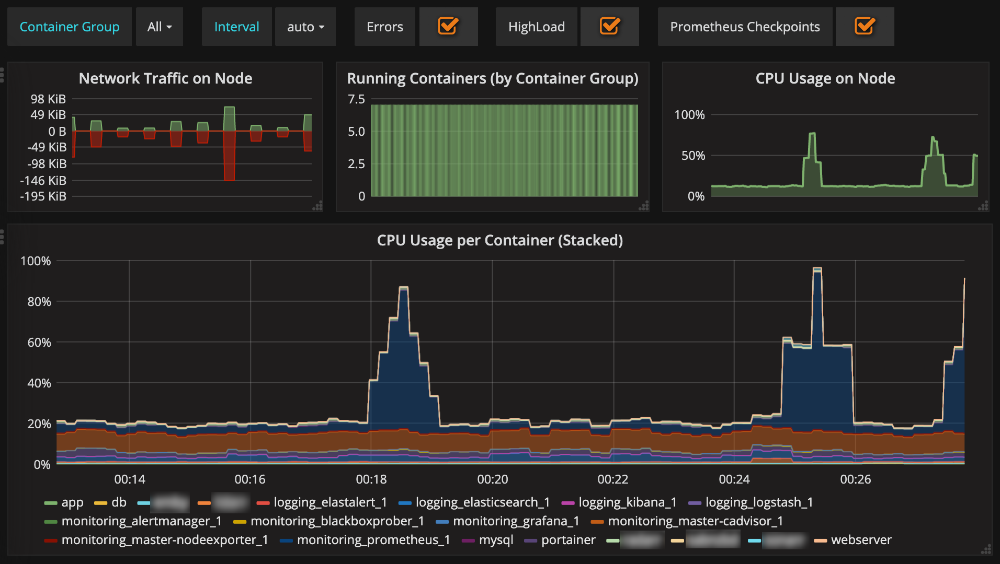

# DIY NAS December 2020

The information contained in this document is aimed at those wanting to build a Linux-based DIY NAS.  These are the steps I have followed for my build and may come in useful.

**Note:** If you read my last guide that covered similar instructions for CentOS 8, this might look familiar.  I'm re-writing it due to the recent RedHat announcement that CentOS Linux is being "killed off" in favour of CentOS Stream.  "That's a big no from me, dawg."

**Disclaimer: There is absolutely no warranty, express or implied, in ANY of the information contained below.  If you use any of this information, you do so at your own risk.  The writers of this content are not responsible for any loss of any kind that may arise from the use of this information.  You assume all responsibility for using or not using this information!**

An important consideration before taking any of the advice in this document is that the choice of hardware is completely up to you.  For reference, this info was prepared and tested on a Ubuntu 20.04.1 virtual machine, then used in production on physical hardware.

*Configuration steps will be different if you choose a different Linux distribution.  The steps will be identical if you use Ubuntu 20.04.1 but I can't guarantee the steps will be identical on any other distribution.  To keep things simple, the operating system in use through this document will be referred to simply as "Ubuntu".*

## Credit

In many places, I have used tested and working information provided by other online articles.  I have verified this information as working on my system and will link to the information as required.

I don't take credit for any of the information in the linked articles and thank those authors for their work.

## Editing Configuration Files

Throughout this guide I'll use `vi` as the editor of choice.  There are far too many choices to list, although popular choices could also be `Nano`, `Pico`, `vim` etc.

As an entry-level primer, using `vi` to make quick edits can be done as follows.

1. Open the file for editing using the following command:

   ```
   vi file.txt
   ```

2. Press `i` to put `vi` into INSERT mode.

3. Make your changes, navigating around the file as you would almost any other editor (

   *It is possible that navigation with arrow keys may produce unexpected results.  One way to "fix" this, depending on your environment, is to install the `vim` package.*

4. When you have finished making changes, exit INSERT mode, save your changes and quit all at once by pressing ESC then using the following key sequence:

   ```
   :wq
   ```

## Prequisites

Your Ubuntu system should have at least 1 non-root user with a username of your choice.  While you **could** use the "root" user without requiring `sudo` privilege escalation, that is universally considered bad security practice.

For reference, my username throughout all screenshots is simply "chris".

The first section is making sure your machine is ready to proceed.

1. First, make sure your Ubuntu system is up-to-date and has all latest packages.

   ```
   sudo apt-get -y update
   ```

2. Install OpenSSH-Server if it has not already been installed.

   ```
   sudo apt-get install -y openssh-server
   sudo systemctl enable sshd --now
   ```

3. Set an appropriate hostname for your NAS.  The choice of hostname is completely up to you and is optional, if you plan to access the NAS via IP address.

   ```
   sudo hostnamectl set-hostname <hostname_here>
   ```

   You may need to logout and login again to see this change to take effect.

## Add SSH Key Pair (Optional)

For remote command-line administration via SSH, it can be useful to add your SSH public key to your `authorized_keys` file on the Ubuntu server.  These steps assume the remote workstation is running Linux, although the same commands will work on Mac OS X.  The paths below may be different, though.

1. Generate an SSH key pair.

   ```
   ssh-keygen -t rsa -b 4096 -C <your_email_address_here>
   ```

   The default filenames are **/home/<username>/.ssh/id_rsa** and **/home/<username>/.ssh/id_rsa.pub**.  Alter these as necessary in upcoming steps, if you opt to use different filenames.

2. Copy your SSH public key to your account's `authorized_keys` file on the Ubuntu server.

   ```
   ssh-copy-id -i <keyfile> <username>@<ubuntu_ip_address_or_hostname>
   ```

3. Test password-less login.

   ```
   ssh <username>@<ubuntu_ip_address_or_hostname>
   ```

   *Use the command below to specify an SSH key, if your key names don't match the defaults.*

   ```
   ssh <username>@<ubuntu_ip_address_or_hostname> -i ~/.ssh/<rsa_public_key_filename>
   ```

## Configure Ubuntu 20.04.1 Server

The next sections can be used or not used as you see fit.  For example, you may not choose to use ZFS as your NAS filesystem.  If that's the case, just skip that section.

*In all steps that make use of `apt-get`, I have used the `-y` switch.  This prevents `apt-get` for asking for confirmation before installing packages.  You may wish to run `apt-get` without the `-y` switch if you'd like to see what it's doing at each step.*

### Ubuntu 20.04.1

1. Update Ubuntu packages.

   ```
   sudo apt-get -y update
   ```

2. Install useful packages.
   
   **Note:** This will install `firewalld` as well as other packages.  Please be aware of the implications of installing `firewalld` before you continue.

   ```
   sudo apt-get -y install git curl rsync bind9-utils net-tools firewalld
   sudo systemctl enable firewalld --now
   sudo firewall-cmd --permanent --add-service=ssh
   sudo firewall-cmd --reload
   ```

3. Install temperature monitors.

   ```
   sudo apt-get install -y hddtemp
   ```

### Mail

I use `sendmail` on my server as a means to send email when "stuff" happens.

1. Install the required packages.

   ```
   sudo apt-get -y install sendmail sendmail-cf m4
   ```

2. Make sure the following line is **uncommented** in `/etc/mail/sendmail.mc`:

   ```
   dnl DAEMON_OPTIONS(`Port=smtp,Addr=127.0.0.1, Name=MTA')dnl
   ```

3. Above the first occurrence of `MAILER`, add this line:

   ```
   FEATURE(`relay_hosts_only')dnl
   ```

4. Find the hostname of your server, and add it to `/etc/mail/relay-domains`:

   ```
   hostname
   ```

   Note down the hostname from the step above and add it to `/etc/mail/relay-domains`.

   I had to do this as the `root` user - not even `sudo`.  To do this, you may run `sudo su -` to switch to the `root` user, then type `exit` when you're finished running commands as `root`.

5. Recompile the `sendmail` configuration:

   ```
   m4 /etc/mail/sendmail.mc > /etc/mail/sendmail.cf
   ```

   I also had to do this step as `root` - `sudo` didn't work.

6. Restart `sendmail` service.

   ```
   sudo systemctl restart sendmail
   ```

7. Send a test email:

   **Note: You may have to enter these commands manually, depending on how well copy/paste works.**

   ```
   cat > /tmp/email.txt << 'EOF'
   Subject: Test email
   From: <put_your_sender_email_address_here>
   
   This is a test email.
   Did you receive it?
   EOF
   ```

   ```
   sendmail <put_your_recipient_email_address_here> < /tmp/email.txt
   ```

### KVM

1. Install the `kvm-ok` tool.

   ```
   sudo apt-get -y install cpu-checker
   ```

2. Verify KVM support is present.

   ```
   sudo kvm-ok
   ```

   A result of **4** indicates the system is ready to run VMs.

3. Install KVM.

   ```
   sudo apt install -y qemu qemu-kvm libvirt-daemon libvirt-clients bridge-utils virt-manager
   sudo systemctl enable libvirtd --now
   ```

   Resources: [Creating and managing KVM virtual machines from CLI](https://linuxconfig.org/how-to-create-and-manage-kvm-virtual-machines-from-cli)

### Configure Networking

1. Create bridge interface and routed network.  The routed network step can be skipped if you don't need it; please note the creation of a routed network will require changes to your upstream router.

   **Note:** This section is not yet updated for use with Ubuntu.  Don't use, yet.

   Sources: [How to install KVM on CentOS 7 / RHEL 7 Headless Server](https://www.cyberciti.biz/faq/how-to-install-kvm-on-centos-7-rhel-7-headless-server/) and [KVM: Creating a guest VM on a network in routed mode](https://fabianlee.org/2019/06/05/kvm-creating-a-guest-vm-on-a-network-in-routed-mode/)

   - Get your LAN interface name:

     ```
     ip a | grep enp
     ```

     

     You can see on this system that the LAN interface is named `enp8s0`.

   - Edit the `/etc/sysconfig/network-scripts/ifcfg-enp8s0` file and add this line at the end.  This assumes you'd like the bridged interface to be named `br0` and that your Ethernet interface name is `enp8s0`.  Adjust these settings as necessary.

     ```
     BRIDGE="br0"
     ```

   - Create an interface configuration for `br0`.

     ```
     sudo touch /etc/sysconfig/network-scripts/ifcfg-br0
     ```

   - Configure the `br0` to have a static IP address by adding the following content to the new file.  Replace **IPADDR**, **GATEWAY** and **DNS1** as necessary.

     ```
     STP=no
     TYPE=Bridge
     PROXY_METHOD=none
     BROWSER_ONLY=no
     BOOTPROTO=none
     IPADDR=<required_ip_address>
     PREFIX=24
     GATEWAY=<required_gateway>
     DNS1=<dns_server>
     DEFROUTE=yes
     IPV4_FAILURE_FATAL=no
     IPV6INIT=no
     NAME=br0
     DEVICE=br0
     ONBOOT=yes
     AUTOCONNECT_SLAVES=yes
     ```

   - Apply the changes by restarting the `NetworkManager` service.

     ```
     sudo systemctl restart NetworkManager
     ```

   - Verify IP forwarding is enabled.

     *Thanks to Fabian Lee, author of the referenced source article, for the information about IP forwarding and creating routed networks.*

     ```
     sudo cat /proc/sys/net/ipv4/ip_forward
     ```

     If this returns **1**, you may skip to the next section.  If this returns **0**, continue below.

     - Enable IPv4 forwarding for the current session.
     
       ```
       sudo sysctl -w net.ipv4.ip_forward=1
       ```

     - Enable IPv4 permanently by adding the following line to `/etc/sysctl.conf`.

       ```
       net.ipv4.ip_forward=1
       ```

   - Create the routed network XML configuration:
   
     ```
     cat <<EOF > routed225.xml
     <network>
       <name>routed225</name>
       <forward mode='route' dev='br0'/>
       <bridge name='virbr225' stp='on' delay='2'/>
       <ip address='192.168.225.1' netmask='255.255.255.0'>
         <dhcp>
           <range start='192.168.225.100' end='192.168.225.200'/>
           <host name='myclone3' ip='192.168.225.143'/>
         </dhcp>
       </ip>
     </network>
     EOF

   - Create and start the network, then set it to start automatically.

     ```
     sudo virsh net-define routed225.xml
     sudo virsh net-start routed225
     sudo virsh net-autostart routed225
     ```

   - Verify the network exists and is active.

     ```
     sudo virsh net-list --all
     ```

     

### OpenZFS

Resources: [ZFS Handbook](https://www.freebsd.org/doc/handbook), old but useful and still working [Transparent compression filesystem in conjunction with ext4](https://serverfault.com/questions/617648/transparent-compression-filesystem-in-conjunction-with-ext4/617791#617791)

1. Install OpenZFS.

   ```
   sudo apt-get -y install zfsutils-linux
   ```

2. Ensure the ZFS module can be loaded.

   ```
   sudo modprobe zfs
   ```

5. Ensure the ZFS modules get loaded at runtime.

   - Edit `/etc/modules` and add the following line to the new file.

     ```
     zfs
     ```

   - Reboot to ensure the ZFS modules are loaded when the system starts.
   - Create pools using Cockpit, if that's the easiest way for you.  The usage and configuration of ZFS-specific stuff is beyond the scope of this article.

6. Schedule ZFS Scrub - Optional

   Resources: [Scheduling automated ZFS scrubs](https://brismuth.com/scheduling-automated-zfs-scrubs-9b2b452e08a4)

   Run the following command, then add the text below to the `root` user crontab.

   ```
   sudo crontab -e
   ```

   ```
   # zpool scrub on the first of every month at 2300
   0 23 1 * * /usr/sbin/zpool scrub <zfs_pool_name>
   # get the pool status on the second of every month at midday
   0 12 2 * * /usr/sbin/zpool status
   ```

7. Setup ZFS email notifications - Optional

   Resources: [Configuring ZFS Event Daemon (ZED) on Ubuntu 16.04](https://medium.com/@arunderwood/configuring-zfs-event-daemon-zed-on-ubuntu-16-04-ee9ac2623c86).

   - Install `mail`:

     ```
     sudo apt-get install -y mail sendmail
     ```

   - Edit `/etc/zfs/zed.d/zed.rc` and make appropriate changes as per the article.
   - Edit `/etc/aliases` and set the following lines so they're something like this (replace the name and email address as necessary):

     ```
     # Person who should get root's mail
     root:          jane
     jane:          jane@doe.com
     ```

   - Restart `zed` and check status:

     ```
     sudo systemctl restart zed
     sudo systemctl status zed
     ```
   
### NFS Server

1. Install NFS packages.

   ```
   sudo apt-get -y install nfs-common
   ```

2. Allow access to NFS through the firewall.

   ```
   sudo firewall-cmd --add-service=nfs --permanent
   sudo firewall-cmd --reload
   ```

3. Create NFS exports in `/etc/exports`.  The file below is an example only.

   ```
   # read-write access allowed by machine with IP address 192.168.100.101 only
   /tank/backups 192.168.100.101(rw,sync,all_squash,no_subtree_check,fsid=1)
   # read-only access allowed by all machines
   /tank/files *(ro,sync,all_squash,no_subtree_check,fsid=1)
   ```

### Docker

1. Remove old versions of Docker.

   ```
   sudo apt-get -y remove docker docker-engine docker.io containerd runc
   ```

2. Install prerequisites.

   ```
   sudo apt-get install -y apt-transport-https ca-certificates curl gnupg-agent software-properties-common
   ```

3. Install the Docker GPG key.

   ```
   curl -fsSL https://download.docker.com/linux/ubuntu/gpg | sudo apt-key add -
   ```

4. Add the Docker repository.

   ```
   sudo add-apt-repository "deb [arch=amd64] https://download.docker.com/linux/ubuntu $(lsb_release -cs) stable"
   ```

5. Install Docker.

   ```
   sudo apt-get -y update
   sudo apt-get -y install docker-ce docker-ce-cli containerd.io
   ```

6. Make sure the Docker service starts when the server boots.

   ```
   sudo systemctl enable docker --now
   ```

7. Configure the default IP address to use when binding container ports.

   Source: [dockerd Documentation](https://docs.docker.com/engine/reference/commandline/dockerd/)

   - Create /etc/docker/daemon.json

     ```
     sudo touch /etc/docker/daemon.json
     ```

   - Add the following content to `/etc/docker/daemon.json`, replacing your IP address as necessary.

     ```
     {
         "ip": "<ubuntu_ip_address>"
     }
     ```

   - Restart the Docker service.

     ```
     sudo systemctl restart docker
     ```

   - Create a Docker user.  This is recommended to avoid poor security practices like setting global permissions on files accessed by containers.

     ```
     sudo useradd docker -g docker
     sudo passwd docker
     ```

   - Get the user ID (UID) and group ID (GID) for the new `docker` user.

     ```
     sudo cat /etc/passwd | grep docker
     ```

     

     In this example, the UID is **1001** and the GID is **998**.

     *At this point you can set permissions on the folders used by docker containers.  For example, if you have a Plex container that stores its configuration in `/storage/appdata/plex`, you can run the following command to set ownership on that folder.  This assumes the container will run **as** the `docker` user.*

     ```
     sudo chown -R docker:docker /storage/appdata/plex
     ```

   - Add your user account to the `docker` group.  This is optional, but allows your user to run `docker` commands without requiring `sudo`.

     ```
     sudo usermod -a -G docker <username>
     ```
     
     You will need to logout and log back in again for this change to take effect.

   - Run the ubiquitous "Hello World" container to make sure Ddocker functions as expected.

     ```
     docker run hello-world
     ```

     

### Docker Compose

Source: [Install Docker Compose](https://www.digitalocean.com/community/tutorials/how-to-install-and-use-docker-compose-on-ubuntu-20-04)

1. Download the latest stable release and make the binary executable.

   ```
   sudo curl -L "https://github.com/docker/compose/releases/download/1.27.4/docker-compose-$(uname -s)-$(uname -m)" -o /usr/local/bin/docker-compose
   sudo chmod +x /usr/local/bin/docker-compose
   ```

2. Create a folder to hold your `docker-compose.yml` and related Docker Compose files.

   ```
   md ~/docker
   ```

3. Create the environment variables file.  Note the file is `.env` - there's no filename extension.

   ```
   touch ~/docker/.env
   ```

4. Add required environment variables to the Docker Compose environment file.  Here's an example that includes the `docker` group and user IDs from earlier.

   ```
   IP=192.168.100.100
   PUID=1001
   PGID=988
   STORAGE_ROOT=/tank
   ```

### Docker Swarm

For my configuration, I'm using Docker Swarm to control the use of multiple containers for the services that need them.  The initial configuration only has the NAS itself as a swarm worker and manager, but additional workers can be added at any time.

1. Create a Docker Swarm.

   ```
   sudo docker swarm init --advertise-addr=<ubuntu_nas_ip_address>
   ```
   
   

2. In some situations (I don't know why) it seems the upcoming initialisation commands can fail due to the absence of an ingress network.  To ensure your system has at least one ingress network, list the existing networks and look for a network named "INGRESS" with a driver type of "OVERLAY".

   ```
   sudo docker network ls
   ```

   

   If there is no ingress network defined e.g. if all networks were deleted for some reason, an ingress network can be recreated with the following command.

   ```
   sudo docker network create --ingress --driver overlay ingress
   ```

3. From here it's a case of creating your `docker-compose.yml` file, since Docker Stack supports that format. After you have created that file (it can be named anything you like), deploy the Docker Stack as follows.

   ```
   sudo docker stack deploy --compose-file docker-compose.yml [application_name]
   ```

4. In my application, named `diy-nas`, I have a service named `bind` that runs DNS services.  There are 3 replicas of the `bind` container and I can quickly stop or start the `named` service on each of them by running this command.

   ```
   for i in $(docker ps -a | grep bind | awk '{print $1;}'); do docker exec -ti $i /etc/init.d/named start; done
   ```

   

5. Because various services have been deployed via Docker Swarm, some of those require firewall ports to be opened.  For example:

   ```
   # mongodb
   sudo firewall-cmd --permanent --add-port=27017/tcp
   sudo firewall-cmd --reload
   ```

### Portainer

Source: [Installing Portainer](https://www.portainer.io/installation/)

*Note: The official documentation uses `docker run` to start Portainer,  but in this example I'm using `docker-compose`.  Docker Swarm was mentioned above as that's what I use in production, but this example may be easier than going down the Docker Swarm road.

1. Create a file named `~/docker/docker-compose.yml`

   ```
   touch ~/docker/docker-compose.yml
   ```

2. Add these contents to the `~/docker/docker-compose.yml` file.

   ```
   version: '3.8'
   services:
     portainer:
       container_name: portainer
       image: portainer/portainer:latest
       command: -H unix:///var/run/docker.sock
       restart: unless-stopped
       ports:
         - "${IP}:8000:8000"
         - "${IP}:9000:9000"
       volumes:
         - /var/run/docker.sock:/var/run/docker.sock
         - portainer_data:/data
   volumes:
     portainer_data:
   ```

   As you can see, we've used the `IP` variable from the `.env` file as the IP address to bind to.

3. Start Portainer in detached mode so that it runs in the background.

   ```
   docker-compose up -d
   ```

   This format above can be used for all your other containers, as required.  See the `docker/docker-compose.yml` file in this repo for a slightly more detailed example.

   

4. Allow access to Portainer through the firewall.

   ```
   sudo firewall-cmd --add-port=9000/tcp --permanent
   sudo firewall-cmd --reload
   ```

5. Test Portainer by browsing to to `http://<ubuntu_ip_address_or_hostname>:9000`

### Container Monitoring with Grafana

This step is completely optional and should be thought about carefully before implementing.  The "Docker Monitoring Logging Alert" suite described here will deploy 13 different containers for different tasks - make sure your NAS or server has sufficient resources to do this.

1. By default, port 9090 is used by the Prometheus database.  In a later section of this document is Cockpit UI - this also runs on port 9090 by default.  I would strongly recommend changing the Cockpit UI port using the steps in that section, rather than changing the Prometheus port by modifying the included Docker Compose files.

2. Deploy the suite by following the [instructions](https://github.com/uschtwill/docker_monitoring_logging_alerting) in the repo.

   *Note: The prereuisites for this suite indicate a requirement for `apache2-utils`.  This is because the suite requires the `htpasswd` command.  On Ubuntu 20.04.1, the `htpasswd` command is part of the `apache2-utils` package.  Install this as follows.

   ```
   sudo apt-get install -y apache2-utils
   ```

   

### PCP - Performance Co-Pilot

Performance Co-Pilot, when installed alongside Cockpit UI in this configuration (see next section), will allow analysis of historical performance metrics.  Without this, Cockpit UI will show a snapshot of the current performance only, with no historical data.

1. Install PCP.

   ```
   sudo apt-get install -y pcp
   ```

2. Start PCP.

   ```
   sudo systemctl enable pmcd --now
   sudo systemctl enable pmproxy --now
   ```

3. Check PCP operation.

   ```
   pcp
   ```

   

### Cockpit UI

*Cockpit UI could be optional if you prefer to use Webmin in the next section.*

Source: [Cockpit UI](https://cockpit-project.org/)

**Important note:** The steps in this section will install Cockpit from Ubuntu **Backports**.  There are risks associated with this that you should be familiar with, before continuing.

1. Download the appropriate installation files.  These steps are for Cockpit version 233.  I'm based in Australia so I'm using the Ubuntu AU mirror.

   ```
   cd ~
   mkdir cockpit
   cd cockpit
   wget http://au.archive.ubuntu.com/ubuntu/pool/universe/c/cockpit/cockpit-bridge_233-1~ubuntu20.04.1_amd64.deb
   wget http://au.archive.ubuntu.com/ubuntu/pool/universe/c/cockpit/cockpit-dashboard_233-1~ubuntu20.04.1_all.deb
   wget http://au.archive.ubuntu.com/ubuntu/pool/universe/c/cockpit/cockpit-ws_233-1~ubuntu20.04.1_amd64.deb
   wget http://au.archive.ubuntu.com/ubuntu/pool/universe/c/cockpit/cockpit-system_233-1~ubuntu20.04.1_all.deb
   wget http://au.archive.ubuntu.com/ubuntu/pool/universe/c/cockpit/cockpit_233-1~ubuntu20.04.1_all.deb
   wget http://au.archive.ubuntu.com/ubuntu/pool/universe/c/cockpit/cockpit-storaged_233-1~ubuntu20.04.1_all.deb
   wget http://au.archive.ubuntu.com/ubuntu/pool/universe/c/cockpit/cockpit-pcp_233-1~ubuntu20.04.1_amd64.deb
   wget http://au.archive.ubuntu.com/ubuntu/pool/universe/c/cockpit/cockpit-networkmanager_233-1~ubuntu20.04.1_all.deb
   wget http://au.archive.ubuntu.com/ubuntu/pool/universe/c/cockpit/cockpit-doc_233-1~ubuntu20.04.1_all.deb
   wget http://au.archive.ubuntu.com/ubuntu/pool/universe/c/cockpit/cockpit-machines_233-1~ubuntu20.04.1_all.deb
   wget http://au.archive.ubuntu.com/ubuntu/pool/universe/c/cockpit/cockpit-packagekit_233-1~ubuntu20.04.1_all.deb
   # wget http://au.archive.ubuntu.com/ubuntu/pool/universe/c/cockpit/cockpit-tests_233-1~ubuntu20.04.1_amd64.deb
   ```

2. Install Cockpit.

   ```
   cd ~/cockpit
   sudo dpkg -i cockpit-bridge_233-1~ubuntu20.04.1_amd64.deb
   sudo dpkg -i cockpit-ws_233-1~ubuntu20.04.1_amd64.deb
   sudo dpkg -i cockpit-dashboard_233-1~ubuntu20.04.1_all.deb
   sudo dpkg -i cockpit-system_233-1~ubuntu20.04.1_all.deb
   sudo dpkg -i cockpit_233-1~ubuntu20.04.1_all.deb
   sudo dpkg -i cockpit-storaged_233-1~ubuntu20.04.1_all.deb
   sudo dpkg -i cockpit-networkmanager_233-1~ubuntu20.04.1_all.deb
   sudo dpkg -i cockpit-doc_233-1~ubuntu20.04.1_all.deb
   sudo dpkg -i cockpit-machines_233-1~ubuntu20.04.1_all.deb
   sudo dpkg -i cockpit-packagekit_233-1~ubuntu20.04.1_all.deb
   # sudo dpkg -i cockpit-tests_233-1~ubuntu20.04.1_amd64.deb
   ```
 
2. Install PCP and Cockpit Machines.

   ```
   sudo apt-get -y install libpcp3 libvirt-dbus
   sudo dpkg -i install cockpit-pcp_233-1~ubuntu20.04.1_amd64.deb
   sudo dpkg -i install cockpit-machines_233-1~ubuntu20.04.1_all.deb
   ```

3. Optionally, reconfigure the Cockpit port from 9090 to the port you need.

   The directions are located [here](https://cockpit-project.org/guide/latest/listen.html).

   If you do this, restarting `cockpit.socket` will need to be done like this:

   ```
   sudo setenforce 0
   sudo systemctl restart cockpit.socket
   sudo setenforce 1
   ```

4. Enable and start the Cockpit service.

   ```
   sudo systemctl enable cockpit.socket --now
   ```

5. Allow access to Cockpit through the firewall.  This will probably say the rule is already enabled, but it is safe to ignore that message.

   - If you **HAVE NOT** changed the Cockpit port from 9090 to something else:

     ```
     sudo firewall-cmd --permanent --add-service=cockpit
     sudo firewall-cmd --reload
     ```

   - If you **HAVE** changed the Cockpit port from 9090 to something else.  Replace **<port>** to match your environment.

     ```
     sudo firewall-cmd --permanent --add-port=<port>/tcp
     sudo firewall-cmd --reload
     ```

6. If using ZFS, install the Cockpit ZFS plugin.

   ```
   sudo apt-get -y install git
   cd ~
   git clone https://github.com/optimans/cockpit-zfs-manager.git
   sudo cp -r cockpit-zfs-manager/zfs /usr/share/cockpit
   ```

7. Optionally, install your SSL certificates as per the [Cockpit Guide](https://cockpit-project.org/guide/172/https.html).  To see where Cockpit currently stores the default SSL certificate and which certificate it is currently using, run the following command.

   ```
   sudo remotectl certificate
   ```

   By default, Cockpit will most likely use a certificate named `0-self-signed.cert`.

8. Test Cockpit by browsing to to `https://<ubuntu_ip_address_or_hostname>:9090`

### Webmin

*Webmin could be optional if you prefer to use Cockpit UI from the previous section.*

1. Add the Webmin APT sources by adding this line to the bottom of `/etc/apt/sources.list`:

   ```
   deb http://download.webmin.com/download/repository sarge contrib
   ```

2. Add the Webmin PGP key.

   ```
   wget -q -O- http://www.webmin.com/jcameron-key.asc | sudo apt-key add
   ```

3. Update the APT sources.

   ```
   sudo apt-get update
   ```


4. Install Webmin.

   ```
   sudo apt-get install -y webmin
   ```

5. Allow access to Webmin through the firewall, if you have `firewalld` installed.

   ```
   sudo firewall-cmd --add-port=10000/tcp --permanent
   sudo firewall-cmd --reload
   ```

6. Test Webmin by browsing to `https://<ubuntu_ip_address_or_hostname>:10000`

## Notes

The notes in this section are for my own use but may come in useful.

### Create ZFS pool from cli.

```
sudo zpool create storage raidz <disk1_id> <disk2_id> <disk3_id> <disk4_id>
sudo zpool set autoexpand=on storage
sudo zfs set compression=lz4 storage
sudo zfs set atime=off storage
sudo zfs create -o volblocksize=128K -s -V 24G storage/main
sudo zpool add storage raidz1 <disk1_id> <disk2_id> <disk3_id> <disk4_id>
```
