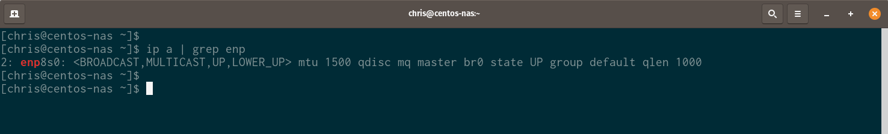
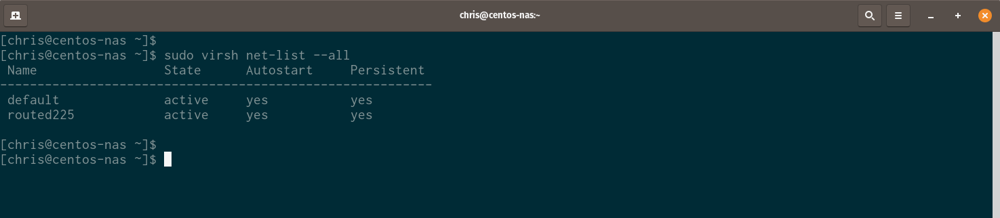
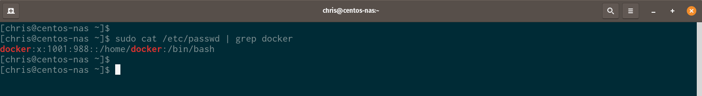
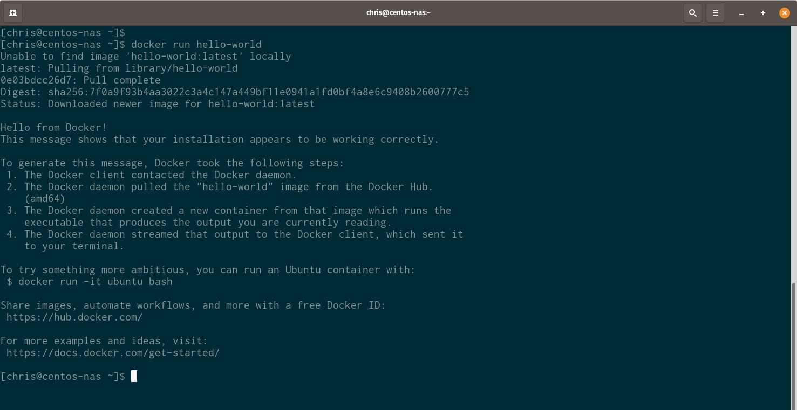
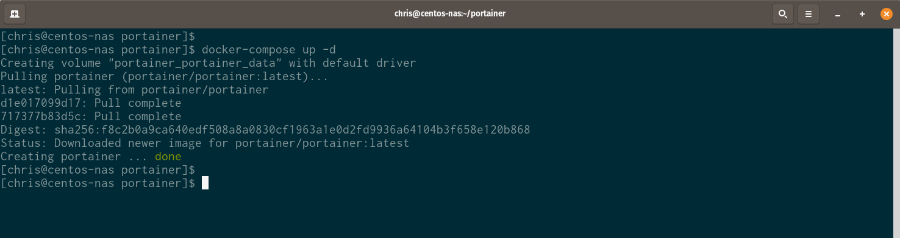
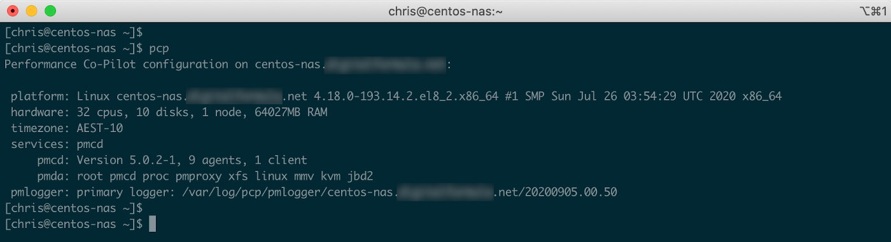

# DIY NAS August 2020

The information contained in this document is aimed at those wanting to build a Linux-based DIY NAS.  These are the steps I have followed for my build and may come in useful.

**Disclaimer: There is absolutely no warranty, express or implied, in ANY of the information contained below.  If you use any of this information, you do so at your own risk.  The writers of this content are not responsible for any loss of any kind that may arise from the use of this information.  You assume all responsibility for using or not using this information!**

An important consideration before taking any of the advice in this document is that the choice of hardware is completely up to you.  For reference, this info was prepared and tested on a CentOS 8.2 virtual machine, then used in production on physical hardware.

*Configuration steps will be different if you choose a different Linux distribution.  The steps will be identical if you use CentOS 8.2 but I can't guarantee the steps will be identical on any other distribution.  To keep things simple, the operating system in use through this document will be referred to simply as "CentOS".*

## Credit

In many places, I have used tested and working information provided by other online articles.  I have verified this information as working on my system and will link to the information as required.

I don't take credit for any of the information in the linked articles and thank those authors for their work.

## Editing Configuration Files

Throughout this guide I'll use `vi` as the editor of choice.  There are far too many choices to list, although popular choices could also be `Nano`, `Pico`, `vim` etc.

As an entry-level primer, using `vi` to make quick edits can be done as follows.

1. Open the file for editing using the following command:

   ```
   vi file.txt
   ```

2. Press `i` to put `vi` into INSERT mode.

3. Make your changes, navigating around the file as you would almost any other editor (

   *It is possible that navigation with arrow keys may produce unexpected results.  One way to "fix" this, depending on your environment, is to install the `vim` package.*

4. When you have finished making changes, exit INSERT mode, save your changes and quit all at once by pressing ESC then using the following key sequence:

   ```
   :wq
   ```

## Prequisites

Your CentOS system should have at least 1 non-root user with a username of your choice.  While you **could** use the "root" user without requiring `sudo` privilege escalation, that is universally considered bad security practice.

For reference, my username throughout all screenshots is simply "chris".

The first section is making sure your machine is ready to proceed.

1. First, make sure your CentOS system is up-to-date and has all latest packages.

   ```
   sudo yum -y update
   ```

2. Install OpenSSH-Server if it has not already been installed.

   ```
   sudo yum -y install openssh-server
   sudo systemctl enable sshd --now
   ```

3. Set an appropriate hostname for your NAS.  The choice of hostname is completely up to you and is optional, if you plan to access the NAS via IP address.

   ```
   sudo hostnamectl set-hostname <hostname_here>
   ```

   You may need to logout and login again to see this change to take effect.

## Add SSH Key Pair (Optional)

For remote command-line administration via SSH, it can be useful to add your SSH public key to your `authorized_keys` file on the CentOS server.  These steps assume the remote workstation is running Linux, although the same commands will work on Mac OS X.  The paths below may be different, though.

1. Generate an SSH key pair.

   ```
   ssh-keygen -t rsa -b 4096 -C <your_email_address_here>
   ```

   The default filenames are **/home/<username>/.ssh/id_rsa** and **/home/<username>/.ssh/id_rsa.pub**.  Alter these as necessary in upcoming steps, if you opt to use different filenames.

2. Copy your SSH public key to your account's `authorized_keys` file on the CentOS server.

   ```
   ssh-copy-id <username>@<centos_ip_address_or_hostname>
   ```

3. Test password-less login.

   ```
   ssh <username>@<centos_ip_address_or_hostname>
   ```

   *Use the command below to specify an SSH key, if your key names don't match the defaults.*

   ```
   ssh <username>@<centos_ip_address_or_hostname> -i ~/.ssh/<rsa_public_key_filename>
   ```

## Configure CentOS 8 Server

The next sections can be used or not used as you see fit.  For example, you may not choose to use ZFS as your NAS filesystem.  If that's the case, just skip that section.

*In all steps that make use of `yum`, I have used the `-y` switch.  This prevents `yum` for asking for confirmation before installing packages.  You may wish to run `yum` without the `-y` switch if you'd like to see what it's doing at each step.*

### CentOS 8.2

1. Update CentOS 8 packages.

   ```
   sudo yum -y update
   ```

2. Install useful packages.

   ```
   sudo yum -y install git curl rsync yum-utils bind-utils net-tools
   ```

3. Install temperature monitors.

   - Install packages.

     ```
     sudo yum -y install epel-release
     sudo dnf install -y hddtemp
     sudo yum -y install lm_sensors
     ```

   - Detect sensors for the first time.

     ```
     sudo sensors-detect
     ```

### Python 3.8

1. Install Python 3.8.  I have Python automation scripts on my NAS and a number of useful system management packages available online will expect Python to be installed.

   ```
   sudo dnf module -y install python38
   ```

### KVM

1. Install KVM.

   ```
   sudo dnf install -y virt-install
   sudo dnf install -y @virt
   sudo systemctl enable libvirtd --now
   ```

   Resources: [Creating and managing KVM virtual machines from CLI](https://linuxconfig.org/how-to-create-and-manage-kvm-virtual-machines-from-cli)

### Configure Networking

1. Create bridge interface and routed network.  The routed network step can be skipped if you don't need it; please note the creation of a routed network will require changes to your upstream router.

   Sources: [How to install KVM on CentOS 7 / RHEL 7 Headless Server](https://www.cyberciti.biz/faq/how-to-install-kvm-on-centos-7-rhel-7-headless-server/) and [KVM: Creating a guest VM on a network in routed mode](https://fabianlee.org/2019/06/05/kvm-creating-a-guest-vm-on-a-network-in-routed-mode/)

   - Get your LAN interface name:

     ```
     ip a | grep enp
     ```

     

     You can see on this system that the LAN interface is named `enp8s0`.

   - Edit the `/etc/sysconfig/network-scripts/ifcfg-enp8s0` file and add this line at the end.  This assumes you'd like the bridged interface to be named `br0` and that your Ethernet interface name is `enp8s0`.  Adjust these settings as necessary.

     ```
     BRIDGE="br0"
     ```

   - Create an interface configuration for `br0`.

     ```
     sudo touch /etc/sysconfig/network-scripts/ifcfg-br0
     ```

   - Configure the `br0` to have a static IP address by adding the following content to the new file.  Replace **IPADDR**, **GATEWAY** and **DNS1** as necessary.

     ```
     STP=no
     TYPE=Bridge
     PROXY_METHOD=none
     BROWSER_ONLY=no
     BOOTPROTO=none
     IPADDR=<required_ip_address>
     PREFIX=24
     GATEWAY=<required_gateway>
     DNS1=<dns_server>
     DEFROUTE=yes
     IPV4_FAILURE_FATAL=no
     IPV6INIT=no
     NAME=br0
     DEVICE=br0
     ONBOOT=yes
     AUTOCONNECT_SLAVES=yes
     ```

   - Apply the changes by restarting the `NetworkManager` service.

     ```
     sudo systemctl restart NetworkManager
     ```

   - Verify IP forwarding is enabled.

     *Thanks to Fabian Lee, author of the referenced source article, for the information about IP forwarding and creating routed networks.*

     ```
     sudo cat /proc/sys/net/ipv4/ip_forward
     ```

     If this returns **1**, you may skip to the next section.  If this returns **0**, continue below.

     - Enable IPv4 forwarding for the current session.
     
       ```
       sudo sysctl -w net.ipv4.ip_forward=1
       ```

     - Enable IPv4 permanently by adding the following line to `/etc/sysctl.conf`.

       ```
       net.ipv4.ip_forward=1
       ```

   - Create the routed network XML configuration:
   
     ```
     cat <<EOF > routed225.xml
     <network>
       <name>routed225</name>
       <forward mode='route' dev='br0'/>
       <bridge name='virbr225' stp='on' delay='2'/>
       <ip address='192.168.225.1' netmask='255.255.255.0'>
         <dhcp>
           <range start='192.168.225.100' end='192.168.225.200'/>
           <host name='myclone3' ip='192.168.225.143'/>
         </dhcp>
       </ip>
     </network>
     EOF

   - Create and start the network, then set it to start automatically.

     ```
     sudo virsh net-define routed225.xml
     sudo virsh net-start routed225
     sudo virsh net-autostart routed225
     ```

   - Verify the network exists and is active.

     ```
     sudo virsh net-list --all
     ```

     

### OpenZFS

Resources: [ZFS Handbook](https://www.freebsd.org/doc/handbook), old but useful and still working [Transparent compression filesystem in conjunction with ext4](https://serverfault.com/questions/617648/transparent-compression-filesystem-in-conjunction-with-ext4/617791#617791)

1. Add the ZFS repository.

   ```
   sudo yum -y install http://download.zfsonlinux.org/epel/zfs-release.el8_2.noarch.rpm
   ```

2. Modify the repository file to enable the kABI-tracking kmods.  Please see the [OpenZFS website](https://openzfs.github.io/openzfs-docs/Getting%20Started/RHEL%20and%20CentOS.html) for information on why you may or may not want to do this.

   - Open `/etc/yum.repos.d/zfs.repo`
   - In the **[zfs]** section, change **enabled=1** to **enabled=0**
   - In the **[zfs-kmod]** section, change **enabled=0** to **enabled=1**

3. Install OpenZFS.

   ```
   sudo yum -y install zfs
   ```

4. Ensure the ZFS module can be loaded.

   ```
   sudo modprobe zfs
   ```

5. Ensure the ZFS modules get loaded at runtime.  Without doing this, my system would "hang" during boot, preventing the ZFS pools from starting automatically.  See the `ZOL 0.8 Not Loading Modules or ZPools on Boot<https://github.com/openzfs/zfs/issues/8885>`_ GitHub issue for details.

   - Create a file named `/etc/modules-load.d/zfs.conf`.
   - Add the following line to the new file.

     ```
     zfs
     ```

   - Reboot to ensure the ZFS modules are loaded when the system starts.
   - Create pools using Cockpit, if that's the easiest way for you.  The usage and configuration of ZFS-specific stuff is beyond the scope of this article.   

### NFS Server

1. Install NFS packages.

   ```
   sudo dnf install nfs-utils
   ```

2. Enable and start the NFS server.

   ```
   sudo systemctl enable nfs-server.service --now
   ```

3. Allow access to NFS through the firewall.

   ```
   sudo firewall-cmd --add-service=nfs --permanent
   sudo firewall-cmd --reload
   ```

4. Create NFS exports in `/etc/exports`.  The file below is an example only.

   ```
   # read-write access allowed by machine with IP address 192.168.100.101 only
   /tank/backups 192.168.100.101(rw,sync,all_squash,no_subtree_check,fsid=1)
   # read-only access allowed by all machines
   /tank/files *(ro,sync,all_squash,no_subtree_check,fsid=1)
   ```

### Docker

Note the commands below make use of the `--nobest` switch.  This allows `dnf` to install packages other than the best candidate.  On CentOS 8, this is the "easiest" way of installing Docker right now, but it is important to be aware that this can cause future issues with updating the `docker-ce` package.

Source: [Answer by Saustrup on serverFault, No network connectivity to/from Docker CE container on CentOS 8](https://serverfault.com/questions/987686/no-network-connectivity-to-from-docker-ce-container-on-centos-8)

1. Add the Docker repository.

   ```
   sudo dnf config-manager --add-repo=https://download.docker.com/linux/centos/docker-ce.repo
   ```

2. Install Docker Container Engine.

   ```
   sudo dnf install -y docker-ce --nobest
   ```

3. Enable and start the Docker service.

   ```
   sudo systemctl enable docker --now
   ```

4. Enable `firewalld` masquerading for the `public` zone.  This fixes things like DNS name resolution from within containers.

   ```
   sudo firewall-cmd --zone=public --add-masquerade --permanent
   sudo firewall-cmd --reload
   ```

5. Configure the default IP address to use when binding container ports.

   Source: [dockerd Documentation](https://docs.docker.com/engine/reference/commandline/dockerd/)

   - Create /etc/docker/daemon.json

     ```
     sudo touch /etc/docker/daemon.json
     ```

   - Add the following content to `/etc/docker/daemon.json`, replacing your IP address as necessary.

     ```
     {
         "ip": "<centos_ip_address>"
     }
     ```

   - Restart the Docker service.

     ```
     sudo systemctl restart docker
     ```

   - Create a Docker user.  This is recommended to avoid poor security practices like setting global permissions on files accessed by containers.

     ```
     sudo useradd docker -g docker
     sudo passwd docker
     ```

   - Get the user ID (UID) and group ID (GID) for the new `docker` user.

     ```
     sudo cat /etc/passwd | grep docker
     ```

     

     In this example, the UID is **1001** and the GID is **988**.

     *At this point you can set permissions on the folders used by docker containers.  For example, if you have a Plex container that stores its configuration in `/storage/appdata/plex`, you can run the following command to set ownership on that folder.  This assumes the container will run **as** the `docker` user.*

     ```
     sudo chown -R docker:docker /storage/appdata/plex
     ```

   - Add your user account to the `docker` group.  This is optional, but allows your user to run `docker` commands without requiring `sudo`.

     ```
     sudo usermod -a -G docker <username>
     ```
     
     You will need to logout and log back in again for this change to take effect.

   - Run the ubiquitous "Hello World" container to make sure Ddocker functions as expected.

     ```
     docker run hello-world
     ```

     

### Docker Compose

Source: [Install Docker Compose](https://docs.docker.com/compose/install/) and [Declare default environment variables in file](https://docs.docker.com/compose/env-file/)

1. Download the latest stable release and make the binary executable.

   ```
   sudo curl -L "https://github.com/docker/compose/releases/download/1.26.2/docker-compose-$(uname -s)-$(uname -m)" -o /usr/local/bin/docker-compose
   sudo chmod +x /usr/local/bin/docker-compose
   ```

2. Create a folder to hold your `docker-compose.yml` and related Docker Compose files.

   ```
   md ~/docker
   ```

3. Create the environment variables file.  Note the file is `.env` - there's no filename extension.

   ```
   touch ~/docker/.env
   ```

4. Add required environment variables to the Docker Compose environment file.  Here's an example that includes the `docker` group and user IDs from earlier.

   ```
   IP=192.168.100.100
   PUID=1001
   PGID=988
   STORAGE_ROOT=/tank
   ```

### Portainer

Source: [Installing Portainer](https://www.portainer.io/installation/)

*Note: The official documentation uses `docker run` to start Portainer,  but I prefer to use `docker-compose`.

1. Create a file named `~/docker/docker-compose.yml`

   ```
   touch ~/docker/docker-compose.yml
   ```

2. Add these contents to the `~/docker/docker-compose.yml` file.

   ```
   version: '3.8'
   services:
     portainer:
       container_name: portainer
       image: portainer/portainer:latest
       command: -H unix:///var/run/docker.sock
       restart: unless-stopped
       ports:
         - "${IP}:8000:8000"
         - "${IP}:9000:9000"
       volumes:
         - /var/run/docker.sock:/var/run/docker.sock
         - portainer_data:/data
   volumes:
     portainer_data:
   ```

   As you can see, we've used the `IP` variable from the `.env` file as the IP address to bind to.

3. Start Portainer in detached mode so that it runs in the background.

   ```
   docker-compose up -d
   ```

   This format above can be used for all your other containers, as required.  See the `docker/docker-compose.yml` file in this repo for a slightly more detailed example.

   

4. Allow access to Portainer through the firewall.

   ```
   sudo firewall-cmd --add-port=9000/tcp --permanent
   sudo firewall-cmd --reload
   ```

5. Test Portainer by browsing to to `http://<centos_ip_address_or_hostname>:9000`

### PCP - Performance Co-Pilot

Performance Co-Pilot, when installed alongside Cockpit UI in this configuration (see next section), will allow analysis of historical performance metrics.  Without this, Cockpit UI will show a snapshot of the current performance only, with no historical data.

1. Install PCP.

   ```
   sudo yum install -y pcp
   ```

2. Start PCP.

   ```
   sudo systemctl start pmcd
   sudo systemctl enable pmcd
   ```

3. Check PCP operation.

   ```
   pcp
   ```

   

### Cockpit UI

*Cockpit UI could be optional if you prefer to use Webmin in the next section.*

Source: [Cockpit UI](https://cockpit-project.org/)

**Important note:** The steps in this section will install the Cockpit **Preview** version.  If you prefer to install the current stable version, skip to step 3.

1. Create the Cockpit Preview repo file.

   ```
   sudo touch /etc/yum.repos.d/cockpit-preview.repo
   ```
   

2. Add the following contents to `/etc/yum.repos.d/cockpit-preview.repo`:

   ``` 
   [copr:copr.fedorainfracloud.org:group_cockpit:cockpit-preview]
   name=Copr repo for cockpit-preview owned by @cockpit
   baseurl=https://download.copr.fedorainfracloud.org/results/@cockpit/cockpit-preview/epel-8-$basearch/
   type=rpm-md
   skip_if_unavailable=True
   gpgcheck=1
   gpgkey=https://download.copr.fedorainfracloud.org/results/@cockpit/cockpit-preview/pubkey.gpg
   repo_gpgcheck=0
   enabled=1
   enabled_metadata=1
   ```

3. Update `yum` cache and install Cockpit Preview

   ```
   sudo yum -y update
   sudo dnf install -y cockpit
   ```

4. Enable and start the Cockpit service.

   ```
   sudo systemctl enable cockpit.socket --now
   ```

3. Allow access to Cockpit through the firewall.  This will probably say the rule is already enabled, but it is safe to ignore that message.

   ```
   sudo firewall-cmd --add-service=cockpit --permanent
   sudo firewall-cmd --reload
   ```

4. If using ZFS, install the Cockpit ZFS plugin.

   ```
   sudo yum -y install git
   cd ~
   git clone https://github.com/optimans/cockpit-zfs-manager.git
   sudo cp -r cockpit-zfs-manager/zfs /usr/share/cockpit
   ```

5. If using KVM, install the Cockpit KVM plugin.

   ```
   sudo dnf install -y cockpit-machines
   ```

6. Optionally, install your SSL certificates as per the [Cockpit Guide](https://cockpit-project.org/guide/172/https.html).  To see where Cockpit currently stores the default SSL certificate and which certificate it is currently using, run the following command.

   ```
   sudo remotectl certificate
   ```

   By default, Cockpit will most likely use a certificate named `0-self-signed.cert`.

6. Test Cockpit by browsing to to `https://<centos_ip_address_or_hostname>:9090`

### Webmin

*Webmin could be optional if you prefer to use Cockpit UI from the previous section.*

1. Add the Webmin repository.

   - Create the repository file.

     ```
     sudo touch /etc/yum.repos.d/webmin.repo
     ```

   - Add the following content to the repo file.

     ```
     [Webmin]
     name=Webmin Distribution Neutral
     baseurl=http://download.webmin.com/download/yum
     enabled=1
     gpgcheck=1
     gpgkey=http://www.webmin.com/jcameron-key.asc
     ```
   
   - Install Webmin.

     ```
     sudo yum -y install webmin
     ```

   - Allow access to Webmin through the firewall.

     ```
     sudo firewall-cmd --add-port=10000/tcp --permanent
     sudo firewall-cmd --reload
     ```

   - Test Webmin by browsing to `https://<centos_ip_address_or_hostname>:10000`

## Notes

The notes in this section are for my own use but may come in useful.

### Create ZFS pool from cli.

```
sudo zpool create storage raidz <disk1_id> <disk2_id> <disk3_id> <disk4_id>
sudo zpool set autoexpand=on storage
sudo zfs set compression=lz4 storage
sudo zfs set atime=off storage
sudo zfs create -o volblocksize=128K -s -V 24G storage/main
sudo zpool add storage raidz1 <disk1_id> <disk2_id> <disk3_id> <disk4_id>
```
